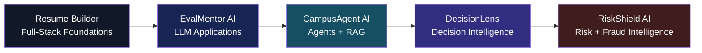
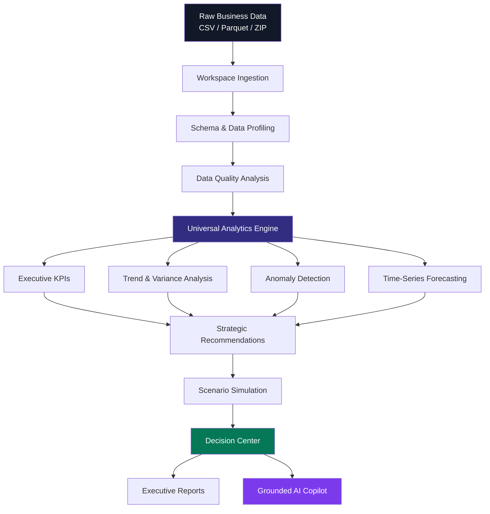
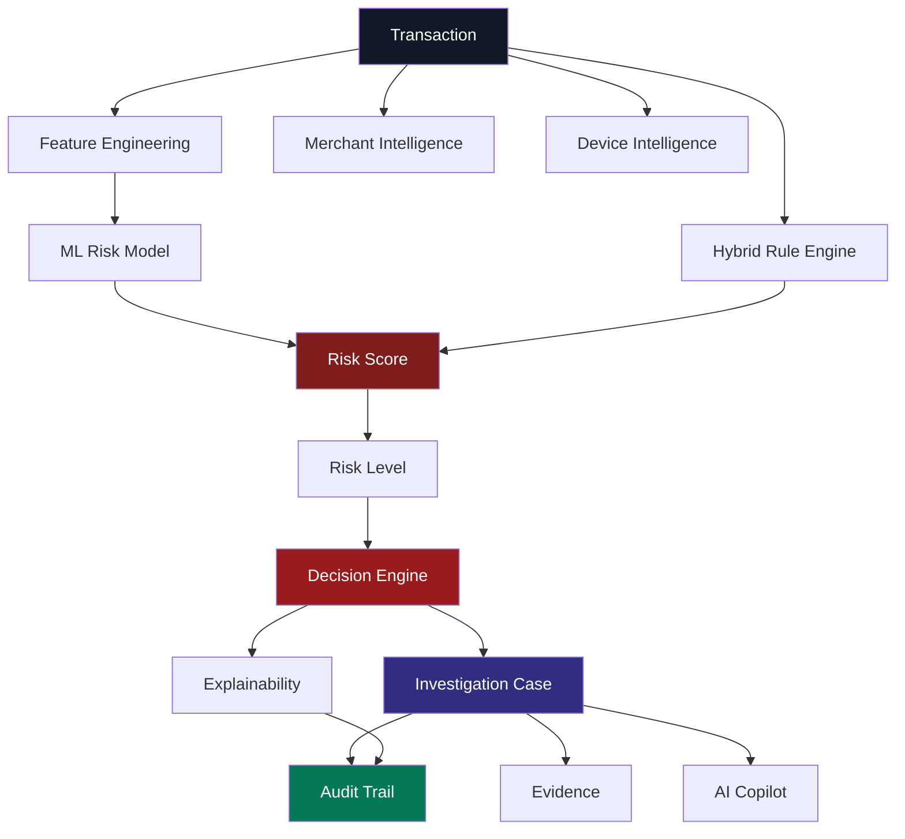
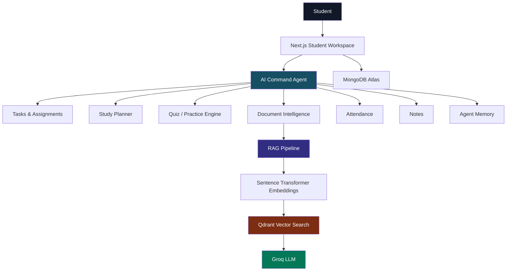
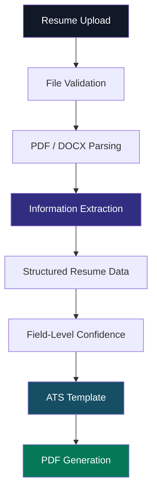
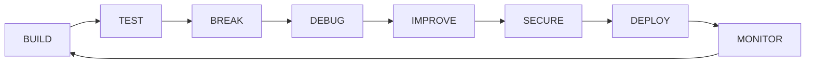

<div align="center">

# ANZAR KHAN

### AI/ML Engineer · Full-Stack Developer · Backend & Data Systems Builder

**I build intelligent software systems that combine AI, analytics, backend engineering, and modern web technologies.**

<br/>

<a href="https://github.com/AnzarKhan855">

</a>
<a href="https://www.linkedin.com/in/anzar-khan-522b712ab/">

</a>

<br/><br/>


</div>

---

# Engineering Profile

I am a **B.Tech student specializing in Artificial Intelligence & Machine Learning**, focused on building practical software rather than isolated prototypes.

My projects span:

* Artificial Intelligence
* Generative AI
* Agentic AI
* Retrieval-Augmented Generation
* Machine Learning
* Full-Stack Development
* Backend Engineering
* Data Analytics
* Decision Intelligence
* Risk & Fraud Intelligence
* Document Intelligence
* Forecasting
* Business Intelligence
* API Architecture
* Authentication & Authorization
* Production Deployment

My development philosophy is simple:

```text
                         IDEA
                           │
                           ▼
                    SYSTEM DESIGN
                           │
                           ▼
                    ARCHITECTURE
                           │
              ┌────────────┴────────────┐
              ▼                         ▼
          FRONTEND                  BACKEND
              │                         │
              └────────────┬────────────┘
                           ▼
                       DATA + AI
                           │
                           ▼
                        TESTING
                           │
                           ▼
                       SECURITY
                           │
                           ▼
                       DEPLOYMENT
                           │
                           ▼
                       PRODUCTION
```

> **I don't just build features. I build systems.**

---

# Technology Universe

<div align="center">

### Languages


### Frontend


### Backend


### Databases & Data


### Engineering & DevOps


</div>

### AI / Data Stack

```text
┌──────────────────────────────────────────────────────────────┐
│                      AI / DATA ENGINEERING                    │
├──────────────────────────────────────────────────────────────┤
│                                                              │
│  LLMs                  RAG                  AI Agents         │
│  ├─ Groq               ├─ Qdrant           ├─ Agent Memory   │
│  ├─ LLM APIs           ├─ Embeddings        ├─ AI Commands   │
│  └─ Evaluation         └─ Semantic Search   └─ Automation    │
│                                                              │
│  Machine Learning      Analytics            Intelligence     │
│  ├─ Forecasting        ├─ Pandas            ├─ Risk Scoring  │
│  ├─ Anomaly Detection  ├─ SQL               ├─ KPI Engines   │
│  ├─ Classification     ├─ DuckDB            ├─ Explainability│
│  └─ Prediction         └─ Power BI          └─ Recommendations│
│                                                              │
└──────────────────────────────────────────────────────────────┘
```

---

# Project Portfolio

My projects represent a progression from **full-stack engineering → AI applications → agentic systems → enterprise analytics → AI-driven risk intelligence**.



---

# 01 · DecisionLens

## Enterprise Decision Intelligence & Analytics Platform

> **DecisionLens transforms raw business datasets into executive KPIs, analytical insights, forecasts, recommendations, scenario simulations, and AI-assisted decisions.**

<div align="center">

### 🌐 Live Demo

**https://decisionlens-enterprise-analytics.vercel.app/**

### 📖 API Documentation

**https://decisionlens-enterprise-analytics.onrender.com/docs**

### 💻 Source Code

**https://github.com/AnzarKhan855/decisionlens-enterprise-analytics**

</div>

---

## What Problem Does DecisionLens Solve?

Organizations often have enormous datasets but still depend on manual spreadsheets, dashboards, SQL queries, and analysts to answer basic executive questions:

```text
What happened?
      ↓
Why did it happen?
      ↓
What will happen?
      ↓
What should we do?
```

DecisionLens attempts to turn that entire analytical workflow into a single decision-intelligence platform.

---

## DecisionLens Pipeline



---

## Core Capabilities

### Data Intelligence

* CSV ingestion
* Parquet ingestion
* Multi-table ZIP ingestion
* Schema discovery
* Column profiling
* Data-quality analysis
* Relational structure discovery
* Workspace-scoped datasets

### Business Analytics

* KPI generation
* Revenue analysis
* Volume analysis
* Growth/decline analysis
* Category performance
* Store performance
* Product rankings
* Time-series analysis

### Predictive Intelligence

* Forecasting
* Trend detection
* Historical analysis
* Confidence intervals
* Backtesting
* Adaptive forecasting strategies

### Prescriptive Intelligence

* Strategic recommendations
* Business levers
* ROI-oriented recommendations
* Scenario simulation
* Sensitivity analysis
* Executive decision cards

### AI

* Grounded AI Copilot
* Natural-language analytics
* Query-grounded answers
* Analytical traceability
* Out-of-domain guardrails

---

## Architecture

```text
                         ┌─────────────────────┐
                         │     EXECUTIVE       │
                         │      USER           │
                         └──────────┬──────────┘
                                    │
                                    ▼
                    ╔══════════════════════════╗
                    ║       NEXT.JS UI         ║
                    ║ Dashboard / Analytics    ║
                    ║ Reports / Copilot        ║
                    ╚════════════╤═════════════╝
                                 │
                                 ▼
                    ╔══════════════════════════╗
                    ║       FASTAPI API        ║
                    ║ Auth / RBAC / Workspace  ║
                    ╚════════════╤═════════════╝
                                 │
              ┌──────────────────┼──────────────────┐
              ▼                  ▼                  ▼
       ┌─────────────┐    ┌─────────────┐    ┌─────────────┐
       │ Analytics   │    │ Forecasting │    │ AI Copilot  │
       │ Engine      │    │ Engine      │    │             │
       └──────┬──────┘    └──────┬──────┘    └──────┬──────┘
              └──────────────────┼──────────────────┘
                                 ▼
                    ╔══════════════════════════╗
                    ║      DATA LAYER          ║
                    ║ DuckDB / Parquet /       ║
                    ║ SQLite / MongoDB Atlas   ║
                    ╚══════════════════════════╝
```

---

## Technology

`Python` `FastAPI` `Next.js` `React` `TypeScript` `Tailwind CSS` `Pandas` `NumPy` `DuckDB` `Parquet` `MongoDB Atlas` `SQLite` `Statsmodels` `Scikit-learn`

---

## Engineering Highlights

* Workspace-aware data isolation
* Asynchronous ingestion
* Vectorized analytics
* Large-scale Parquet processing
* Multi-horizon forecasting
* Scenario modeling
* Grounded AI
* JWT authentication
* RBAC
* Production API
* Executive reporting
* Automated backend testing

---

# 02 · RiskShield AI

## AI-Powered Risk & Fraud Intelligence Platform

> **RiskShield AI is my latest major project — an AI-powered platform for transaction risk analysis, fraud intelligence, explainable decisions, and investigation workflows.**

### Current Status

> 🚧 **Currently under active development and being prepared for deployment.**

**No live demo is listed intentionally.**

**No public API documentation link is listed intentionally.**

### 💻 Repository

**https://github.com/AnzarKhan855/riskshield-ai**

---

## What Problem Does RiskShield AI Solve?

Modern digital transactions require more than a binary fraud flag.

A practical risk system needs to answer:

```text
Is this transaction suspicious?
        ↓
Why is it suspicious?
        ↓
Which signals contributed?
        ↓
What should happen next?
        ↓
Can an analyst investigate it?
        ↓
Can the decision be audited?
```

RiskShield AI is designed around that complete workflow.

---

## Risk Intelligence Architecture



---

## Core Modules

### Transaction Intelligence

* Transaction analysis
* Risk scoring
* Risk classification
* Suspicious transaction detection
* Decision generation

### Hybrid Risk Engine

Combines:

```text
             TRANSACTION
                  │
          ┌───────┴────────┐
          ▼                ▼
     ML MODEL          RULE ENGINE
          │                │
          └───────┬────────┘
                  ▼
             RISK SCORE
                  │
                  ▼
          DECISION ENGINE
          ┌────┬────┬────┐
          ▼    ▼    ▼
       APPROVE REVIEW BLOCK
```

### Explainable AI

The platform is designed to move beyond:

> "Risk Score = 0.87"

toward:

> **Why did the system produce this result?**

This includes:

* contributing features
* risk signals
* model outputs
* rule contributions
* human-readable explanations

### Merchant Intelligence

* Merchant history
* Merchant risk signals
* Transaction patterns
* Aggregated behavior

### Device Intelligence

* Device identification
* Device history
* Suspicious device behavior
* User/device relationships

### Investigation

```text
Transaction
     ↓
Case
     ↓
Assignment
     ↓
Evidence
     ↓
Investigation
     ↓
Decision
     ↓
Audit Trail
```

### AI Copilot

Designed to provide contextual risk assistance while respecting application authorization.

---

## Technology

`Python` `FastAPI` `Next.js` `TypeScript` `Tailwind CSS` `MongoDB` `Machine Learning` `AI/LLMs` `Docker` `REST APIs`

---

# 03 · CampusAgent AI

## Agentic AI Student Productivity Platform

> **CampusAgent AI combines academic productivity, agentic AI, document intelligence, RAG, vector search, quizzes, study planning, and AI evaluation into one student platform.**

<div align="center">

### 🌐 Live Demo

**https://campusagent-ai.vercel.app/**

### 📖 API Documentation

**https://campusagent-ai-backend.onrender.com/docs**

### 💻 Source Code

**https://github.com/AnzarKhan855/campusagent-ai**

</div>

---

## Problem

Students often use separate applications for:

* assignments
* attendance
* notes
* PDFs
* reminders
* study plans
* quizzes
* AI tools

CampusAgent AI brings these workflows into one intelligent academic workspace.

---

## Agentic Architecture



---

## Core Features

### Academic Management

* Subjects
* Assignments
* Attendance
* Tasks
* Reminders
* Study plans
* Notes

### AI

* AI command agent
* AI question generation
* AI answer evaluation
* Practice tests
* Weak-topic analysis
* AI-powered study assistance

### Document Intelligence

```text
PDF
 │
 ▼
PyMuPDF
 │
 ▼
Text Extraction
 │
 ▼
Chunking
 │
 ▼
Sentence Transformers
 │
 ▼
Vector Embeddings
 │
 ▼
Qdrant
 │
 ▼
Semantic Retrieval
 │
 ▼
Groq LLM
 │
 ▼
Grounded Answer
```

---

## Technology

`Next.js 16` `React 19` `TypeScript` `Tailwind CSS` `FastAPI` `Python` `MongoDB Atlas` `JWT` `Groq` `Qdrant` `Sentence Transformers` `PyMuPDF`

---

# 04 · EvalMentor AI

## AI Interview Preparation & Evaluation Platform

> **EvalMentor AI uses resume intelligence and LLMs to generate personalized technical interview questions and evaluate candidate answers.**

<div align="center">

### 🌐 Live Demo

**https://evalmentor-ai.vercel.app/**

### 📖 API Documentation

**https://evalmentor-ai.onrender.com/docs**

### 💻 Source Code

**https://github.com/AnzarKhan855/evalmentor-ai**

</div>

---

## End-to-End Interview Pipeline


---

## Core Features

### Resume Intelligence

* PDF upload
* Text extraction
* Technical skill identification
* Project extraction
* Structured candidate information

### Interview Intelligence

* Resume-based question generation
* Role-specific questions
* Technical questions
* Candidate answer submission
* AI evaluation

### Evaluation

The evaluation workflow is designed around multiple dimensions:

```text
Candidate Answer
      │
      ├── Technical Accuracy
      ├── Relevance
      ├── Completeness
      ├── Clarity
      └── Overall Quality
              │
              ▼
       AI Feedback Engine
              │
              ▼
       Improvement Guidance
```

---

## Technology

`Next.js` `TypeScript` `Tailwind CSS` `FastAPI` `Python` `MongoDB Atlas` `JWT` `PyMuPDF` `Groq`

---

# 05 · Resume Builder

## ATS-Friendly Resume Engineering Platform

> **My first major full-stack project — a resume-building platform combining structured resume creation, authentication, templates, PDF generation, and document parsing.**

<div align="center">

### 💻 Source Code

**https://github.com/AnzarKhan855/resume-builder**

### 🌐 Live Demo

**https://anzarkhanresume-builder.vercel.app/**

</div>

---

## Why This Project Matters

Resume Builder represents the foundation of my full-stack development journey.

It introduced:

* authentication
* CRUD architecture
* document processing
* PDF generation
* database persistence
* frontend/backend integration
* reusable UI components
* structured data extraction

---

## Resume Processing Pipeline



---

## Advanced Parsing Work

The project evolved beyond basic resume CRUD.

The parsing system includes concepts such as:

* PDF text extraction
* DOCX validation
* scanned-PDF detection
* structured section extraction
* education recognition
* project recognition
* certification recognition
* location recognition
* field-level confidence
* automated parsing tests
* ATS-oriented templates

---

## Technology

`Next.js` `React` `TypeScript` `Tailwind CSS` `Node.js` `MongoDB` `JWT` `PDF Processing`

---

# 06 · BookStore SQL Analysis

## SQL-Based Business Analytics

> **A data analytics project focused on using SQL to extract business insights from bookstore data.**

### 💻 Repository

**https://github.com/AnzarKhan855/BookStore-SQL-Analysis**

---

## Analytical Workflow

```text
             RAW DATA
                │
                ▼
        DATABASE STRUCTURE
                │
                ▼
          SQL EXPLORATION
                │
       ┌────────┼────────┐
       ▼        ▼        ▼
   CUSTOMERS   BOOKS   ORDERS
       │        │        │
       └────────┼────────┘
                ▼
         BUSINESS METRICS
                │
       ┌────────┼────────┐
       ▼        ▼        ▼
    REVENUE   SALES   CUSTOMER
             ANALYSIS  INSIGHTS
```

---

## Core SQL Concepts

* SELECT
* WHERE
* GROUP BY
* ORDER BY
* JOIN
* Aggregations
* Subqueries
* Filtering
* Business metrics
* Customer analysis
* Sales analysis
* Revenue analysis

---

# Project Architecture Comparison

| Project            | Domain                 | AI | Backend | Database                   | Live              | API Docs |
| ------------------ | ---------------------- | -: | ------- | -------------------------- | ----------------- | -------- |
| **RiskShield AI**  | Risk / Fraud           |  ✓ | FastAPI | MongoDB                    | 🚧 In Development | —        |
| **DecisionLens**   | Enterprise Analytics   |  ✓ | FastAPI | MongoDB / SQLite / Parquet | ✓                 | ✓        |
| **CampusAgent AI** | EdTech / Agents        |  ✓ | FastAPI | MongoDB / Qdrant           | ✓                 | ✓        |
| **EvalMentor AI**  | Interview AI           |  ✓ | FastAPI | MongoDB                    | ✓                 | ✓        |
| **Resume Builder** | Full Stack / Documents |  ✓ | Node.js | MongoDB                    | ✓                 | —        |
| **BookStore SQL**  | Data Analytics         |  — | SQL     | Relational                 | —                 | —        |

---

# Architecture Evolution


---

# Cross-Project Engineering Patterns

Across these projects, I repeatedly work with the same engineering principles.

### Authentication

```text
User
 ↓
Credentials
 ↓
Validation
 ↓
JWT
 ↓
Protected Routes
 ↓
RBAC / Authorization
```

### AI Pipeline

```text
Input
 ↓
Validation
 ↓
Preprocessing
 ↓
Context / Features
 ↓
AI / ML
 ↓
Evaluation
 ↓
Structured Output
 ↓
User Interface
```

### Production API

```text
Request
 ↓
Authentication
 ↓
Authorization
 ↓
Validation
 ↓
Business Logic
 ↓
Database / AI / Analytics
 ↓
Response
 ↓
Logging / Audit
```

---

# Data → Intelligence → Decision

A common theme across my portfolio is transforming raw information into useful decisions.


This pattern appears differently in each project:

| Project        | Data                    | Intelligence                | Outcome             |
| -------------- | ----------------------- | --------------------------- | ------------------- |
| Resume Builder | Resume documents        | Document parsing            | Structured resume   |
| EvalMentor     | Resume + answers        | LLM evaluation              | Interview feedback  |
| CampusAgent    | Academic documents/data | Agents + RAG                | Student assistance  |
| DecisionLens   | Business datasets       | Analytics + forecasting     | Executive decisions |
| RiskShield     | Transactions            | ML + rules + explainability | Risk decisions      |
| BookStore SQL  | Sales/customer data     | SQL analytics               | Business insights   |

---

# Engineering Domains

<div align="center">

| 🤖 AI          | ⚙️ Backend   | 🌐 Full Stack | 📊 Data     |
| -------------- | ------------ | ------------- | ----------- |
| LLMs           | FastAPI      | Next.js       | SQL         |
| RAG            | REST APIs    | React         | Pandas      |
| Agents         | JWT          | TypeScript    | DuckDB      |
| Embeddings     | RBAC         | Tailwind      | Forecasting |
| Explainability | MongoDB      | Responsive UI | Power BI    |
| AI Evaluation  | API Security | Dashboards    | Excel       |

</div>

---

# System Design Thinking

I increasingly approach applications as interconnected systems rather than isolated pages.

```text
                         ┌───────────────────────┐
                         │       USERS           │
                         └───────────┬───────────┘
                                     │
                                     ▼
                    ┌────────────────────────────┐
                    │       PRESENTATION         │
                    │ Next.js / React / Tailwind │
                    └─────────────┬──────────────┘
                                  │
                                  ▼
                    ┌────────────────────────────┐
                    │       API / SERVICES        │
                    │ FastAPI / Node / REST      │
                    └─────────────┬──────────────┘
                                  │
             ┌────────────────────┼────────────────────┐
             ▼                    ▼                    ▼
       ┌──────────┐        ┌────────────┐       ┌────────────┐
       │ DATABASE │        │ AI / ML    │       │ ANALYTICS  │
       └────┬─────┘        └─────┬──────┘       └─────┬──────┘
            │                    │                    │
            └────────────────────┼────────────────────┘
                                 ▼
                    ┌────────────────────────────┐
                    │      BUSINESS LOGIC        │
                    └─────────────┬──────────────┘
                                  ▼
                    ┌────────────────────────────┐
                    │   INTELLIGENT OUTCOMES     │
                    └────────────────────────────┘
```

---

# My Development Loop



> **Build it. Test it. Break it. Fix it. Ship it.**

---

# Current Technical Focus

I am currently strengthening my capabilities in:

### Software Engineering

* Data Structures & Algorithms
* Object-Oriented Programming
* Backend Engineering
* REST API Architecture
* System Design
* Software Testing

### Artificial Intelligence

* LLM Applications
* RAG
* Agentic AI
* AI Evaluation
* Explainable AI
* ML Pipelines
* AI-powered automation

### Data

* SQL
* Data Analytics
* Business Intelligence
* Forecasting
* Data Visualization
* Decision Intelligence

### Production Engineering

* Docker
* Cloud deployment
* API security
* Authentication
* Authorization
* Observability
* Performance engineering

---

# Career Direction

I am interested in opportunities involving:

```text
┌───────────────────────────────────────────────────┐
│                                                   │
│                 AI ENGINEERING                    │
│                      │                            │
│          ┌───────────┼───────────┐                │
│          ▼           ▼           ▼                │
│       SOFTWARE     BACKEND      DATA              │
│       ENGINEERING  ENGINEERING  ANALYTICS         │
│          │           │           │                │
│          └───────────┼───────────┘                │
│                      ▼                            │
│             INTELLIGENT SYSTEMS                  │
│                                                   │
└───────────────────────────────────────────────────┘
```

---

# GitHub Portfolio

<div align="center">

| Project                       | Repository                                                                  | Live                                                          | API                                                                    |
| ----------------------------- | --------------------------------------------------------------------------- | ------------------------------------------------------------- | ---------------------------------------------------------------------- |
| 🛡️ **RiskShield AI**         | [GitHub](https://github.com/AnzarKhan855/riskshield-ai)                     | 🚧 In Development                                             | —                                                                      |
| 🧠 **DecisionLens**           | [GitHub](https://github.com/AnzarKhan855/decisionlens-enterprise-analytics) | [Live](https://decisionlens-enterprise-analytics.vercel.app/) | [Swagger](https://decisionlens-enterprise-analytics.onrender.com/docs) |
| 🎓 **CampusAgent AI**         | [GitHub](https://github.com/AnzarKhan855/campusagent-ai)                    | [Live](https://campusagent-ai.vercel.app/)                    | [Swagger](https://campusagent-ai-backend.onrender.com/docs)            |
| 🤖 **EvalMentor AI**          | [GitHub](https://github.com/AnzarKhan855/evalmentor-ai)                     | [Live](https://evalmentor-ai.vercel.app/)                     | [Swagger](https://evalmentor-ai.onrender.com/docs)                     |
| 📄 **Resume Builder**         | [GitHub](https://github.com/AnzarKhan855/resume-builder)                    | [Live](https://anzarkhanresume-builder.vercel.app/)           | —                                                                      |
| 📚 **BookStore SQL Analysis** | [GitHub](https://github.com/AnzarKhan855/BookStore-SQL-Analysis)            | —                                                             | —                                                                      |

</div>

---

# GitHub Analytics

<div align="center">


<br/><br/>


<br/><br/>


</div>

---

# Contribution Activity

<div align="center">


<br/><br/>


</div>

---

# Repository Map

```text
AnzarKhan855/
│
├── 🛡️ riskshield-ai
│   └── AI Risk & Fraud Intelligence
│
├── 🧠 decisionlens-enterprise-analytics
│   └── Enterprise Decision Intelligence
│
├── 🎓 campusagent-ai
│   └── Agentic AI Student Platform
│
├── 🤖 evalmentor-ai
│   └── AI Interview Evaluation
│
├── 📄 resume-builder
│   └── ATS Resume Engineering
│
├── 📚 BookStore-SQL-Analysis
│   └── SQL Business Analytics
│
├── 🌐 portfolio
│   └── Personal Portfolio
│
└── 🧩 leetcode-solutions
    └── DSA Practice
```

---

# Project Maturity Map

```text
                    PROJECT MATURITY

                         ▲
                         │
                 RISKSHIELD AI
                         │
                DECISIONLENS
                         │
               CAMPUSAGENT AI
                         │
                EVALMENTOR AI
                         │
                RESUME BUILDER
                         │
              BOOKSTORE SQL
                         │
                         └──────────────────────►
                          ENGINEERING COMPLEXITY
```

---

# What These Projects Demonstrate

### Resume Builder

**Full-stack fundamentals**

Authentication · CRUD · document processing · PDF generation · database integration

### EvalMentor AI

**AI application engineering**

LLMs · resume intelligence · evaluation · FastAPI · MongoDB

### CampusAgent AI

**Agentic AI engineering**

Agents · RAG · embeddings · vector search · document intelligence · AI memory

### DecisionLens

**Enterprise analytics engineering**

Large datasets · DuckDB · forecasting · KPIs · recommendations · decision intelligence

### RiskShield AI

**AI + security + risk engineering**

ML risk scoring · hybrid rules · explainability · transaction intelligence · investigation · auditability

### BookStore SQL Analysis

**Data fundamentals**

SQL · joins · aggregations · business analytics · structured data analysis

---

# Technical Philosophy

```text
                 ┌────────────────────────┐
                 │     SOLVE THE PROBLEM   │
                 └────────────┬───────────┘
                              │
                              ▼
                 ┌────────────────────────┐
                 │     DESIGN THE SYSTEM   │
                 └────────────┬───────────┘
                              │
                              ▼
                 ┌────────────────────────┐
                 │      BUILD THE CORE     │
                 └────────────┬───────────┘
                              │
                              ▼
                 ┌────────────────────────┐
                 │       ADD INTELLIGENCE  │
                 └────────────┬───────────┘
                              │
                              ▼
                 ┌────────────────────────┐
                 │      TEST + SECURE      │
                 └────────────┬───────────┘
                              │
                              ▼
                 ┌────────────────────────┐
                 │        DEPLOY           │
                 └────────────┬───────────┘
                              │
                              ▼
                 ┌────────────────────────┐
                 │       ITERATE           │
                 └────────────────────────┘
```

---

# Connect

<div align="center">

<a href="https://github.com/AnzarKhan855">

</a>

<a href="https://www.linkedin.com/in/anzar-khan-522b712ab/">

</a>

</div>

---

<div align="center">

### AI · Software Engineering · Data · Analytics · Intelligent Systems

**Building systems that turn data into intelligence and intelligence into action.**

<br/>


</div>
